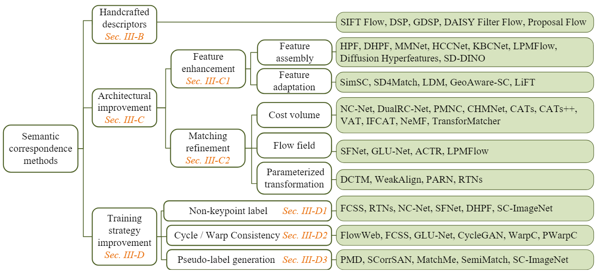

# Semantic Correspondence Methods Paper List

## 🏠 About
To provide a structured understanding of semantic correspondence methods, we present a taxonomy categorizing approaches into handcrafted descriptors, architectural improvements, and training strategy improvements. 
This taxonomy traces the evolution from handcrafted methods to advanced deep learning solutions, providing a clear overview of how different approaches enhance feature quality, matching performance, and training strategies.

## 📚 Contents
- [Handcrafted Descriptors](#handcrafted-descriptors)
- [Architectural Improvement](#architectural-improvement)
  - [Feature Enhancement](#feature-enhancement)
     - [Feature Assembly](#feature-assembly)
     - [Feature Adaptation](#feature-adaptation)
  - [Matching Refinement](#matching-refinement)
     - [Cost Volume-Based Methods](#cost-volume-based-methods)
     - [Flow Field-Based Methods](#flow-field-based-methods)
     - [Parameterized Transformation-Based Methods](#parameterized-transformation-based-methods)
  - [Other Improvements](#other-improvements)
- [Training Strategy Improvement](#training-strategy-improvement)
  - [Non-Keypoint Label-Based Methods](#non-keypoint-label-based-methods)
  - [Cycle/Warp Consistency-Based Methods](#cyclewarp-consistency-based-methods)
  - [Pseudo-Label Generation-Based Methods](#pseudo-label-generation-based-methods)
  - [Other Improvements](#other-improvements)

---

## Handcrafted Descriptors
- *A Maximum Entropy Framework for Part-Based Texture and Object Recognition*  
  Svetlana Lazebnik, Cordelia Schmid, Jean Ponce  
  **ICCV 2005**. 
  [[Paper]](https://ieeexplore.ieee.org/document/1541339)

- *Flexible Object Models for Category-Level 3D Object Recognition*  
  Akash Kushal, Cordelia Schmid, Jean Ponce   
  **CVPR 2007**. 
  [[Paper]](https://ieeexplore.ieee.org/document/4270174/)

- *Sift Flow: Dense Correspondence Across Scenes and Its Applications*  
  Ce Liu, Jenny Yuen, Antonio Torralba   
  **TPAMI 2011**. 
  [[Paper]](https://ieeexplore.ieee.org/document/5551153)
  [[Code]](https://github.com/caomw/sift-flow)

- *Deformable Spatial Pyramid Matching for Fast Dense Correspondences*  
  Jaechul Kim, Ce Liu, Fei Sha, Kristen Grauman   
  **CVPR 2013**. 
  [[Paper]](https://openaccess.thecvf.com/content_cvpr_2013/papers/Kim_Deformable_Spatial_Pyramid_2013_CVPR_paper.pdf)

- *DAISY Filter Flow: A Generalized Discrete Approach to Dense Correspondences*  
  Hongsheng Yang, Wen-Yan Lin, Jiangbo Lu   
  **CVPR 2014**. 
  [[Paper]](https://openaccess.thecvf.com/content_cvpr_2014/papers/Yang_DAISY_Filter_Flow_2014_CVPR_paper.pdf)
  [[Code]](https://github.com/dff-coder/DaisyFilterFlow_CVPR2014)

- *Unsupervised Object Discovery and Localization in the Wild: Part-Based Matching with Bottom-Up Region Proposals*  
  Minsu Cho, Suha Kwak, Cordelia Schmid, Jean Ponce   
  **CVPR 2015**. 
  [[Paper]](https://ieeexplore.ieee.org/document/7298724/)

- *Proposal Flow*  
  Bumsub Ham, Minsu Cho, Cordelia Schmid, Jean Ponce   
  **CVPR 2016**. [[Paper]](https://openaccess.thecvf.com/content_cvpr_2016/papers/Ham_Proposal_Flow_CVPR_2016_paper.pdf)
  [[Project Page]](https://www.di.ens.fr/willow/research/proposalflow/)
  [[Code]](https://github.com/bsham/ProposalFlow)

- *Proposal Flow: Semantic Correspondences from Object Proposals*  
  Bumsub Ham, Minsu Cho, Cordelia Schmid, Jean Ponce   
  **TPAMI 2018**. [[Paper]](https://arxiv.org/abs/1703.07144)
  [[Project Page]](https://www.di.ens.fr/willow/research/proposalflow/)
  [[Code]](https://github.com/bsham/ProposalFlow)

- *Flexible Object Models for Category-Level 3D Object Recognition*  
  Akash Kushal, Cordelia Schmid, Jean Ponce   
  **CVPR 2007**. [[Paper]](https://ieeexplore.ieee.org/document/4270174/)

- *Sift Flow: Dense Correspondence Across Scenes and Its Applications*  
  Ce Liu, Jenny Yuen, Antonio Torralba   
  **TPAMI 2011**. 
  [[Paper]](https://ieeexplore.ieee.org/document/5551153)
  [[Code]](https://github.com/caomw/sift-flow)

- *Deformable Spatial Pyramid Matching for Fast Dense Correspondences*  
  Jaechul Kim, Ce Liu, Fei Sha, Kristen Grauman   
  **CVPR 2013**. 
  [[Paper]](https://openaccess.thecvf.com/content_cvpr_2013/papers/Kim_Deformable_Spatial_Pyramid_2013_CVPR_paper.pdf)

- *DAISY Filter Flow: A Generalized Discrete Approach to Dense Correspondences*  
  Hongsheng Yang, Wen-Yan Lin, Jiangbo Lu   
  **CVPR 2014**. 
  [[Paper]](https://openaccess.thecvf.com/content_cvpr_2014/papers/Yang_DAISY_Filter_Flow_2014_CVPR_paper.pdf)
  [[Code]](https://github.com/dff-coder/DaisyFilterFlow_CVPR2014)

- *Unsupervised Object Discovery and Localization in the Wild: Part-Based Matching with Bottom-Up Region Proposals*  
  Minsu Cho, Suha Kwak, Cordelia Schmid, Jean Ponce   
  **CVPR 2015**. [[Paper]](https://ieeexplore.ieee.org/document/7298724/)

- *Proposal Flow*  
  Bumsub Ham, Minsu Cho, Cordelia Schmid, Jean Ponce   
  **CVPR 2016**. 
  [[Paper]](https://openaccess.thecvf.com/content_cvpr_2016/papers/Ham_Proposal_Flow_CVPR_2016_paper.pdf)
  [[Project Page]](https://www.di.ens.fr/willow/research/proposalflow/)
  [[Code]](https://github.com/bsham/ProposalFlow)

- *Proposal Flow: Semantic Correspondences from Object Proposals*  
  Bumsub Ham, Minsu Cho, Cordelia Schmid, Jean Ponce   
  **TPAMI 2018**. 
  [[Paper]](https://arxiv.org/abs/1703.07144)
  [[Project Page]](https://www.di.ens.fr/willow/research/proposalflow/)
  [[Code]](https://github.com/bsham/ProposalFlow)

## Architectural Improvement
Early CNN methods

- *Universal Correspondence Network*  
  Christopher B. Choy, JunYoung Gwak, Silvio Savarese, Manmohan Chandraker   
  **NeurIPS 2016**. 
  [[Paper]](https://arxiv.org/abs/1606.03558)
  [[Code]](https://github.com/chrischoy/open-ucn)

- *SCNet: Learning Semantic Correspondence*  
  Kai Han, Rafael S. Rezende, Bumsub Ham, Kwan-Yee K. Wong, Minsu Cho, Cordelia Schmid, Jean Ponce   
  **ICCV 2017**. 
  [[Paper]](https://arxiv.org/abs/1705.04043)
  [[Project Page]](https://www.di.ens.fr/willow/research/scnet/)
  [[Code]](https://github.com/k-han/SCNet)

- *FCSS: Fully Convolutional Self-Similarity for Dense Semantic Correspondence*  
  Seungryong Kim, Dongbo Min, Bumsub Ham, Stephen Lin, Kwanghoon Sohn   
  **CVPR 2017**. [[Paper]](https://openaccess.thecvf.com/content_cvpr_2017/papers/Kim_FCSS_Fully_Convolutional_CVPR_2017_paper.pdf) 
  **TPAMI 2019**. [[Paper]](https://ieeexplore.ieee.org/document/8283767)
  [[Project Page]](https://seungryong.github.io/FCSS/)
  [[Code]](https://github.com/seungryong/FCSS)

### Feature Enhancement

#### Feature Assembly

- *Hypercolumns for Object Segmentation and Fine-grained Localization*  
  Bharath Hariharan, Pablo Arbeláez, Ross Girshick, Jitendra Malik   
  **CVPR 2015**. 
  [[Paper]](https://openaccess.thecvf.com/content_cvpr_2015/papers/Hariharan_Hypercolumns_for_Object_2015_CVPR_paper.pdf)  

- *Hyperpixel Flow: Semantic Correspondence with Multi-layer Neural Features*  
  Juhong Min, Jongmin Lee, Jean Ponce, Minsu Cho   
  **ICCV 2019**. 
  [[Paper]](https://openaccess.thecvf.com/content_ICCV_2019/papers/Min_Hyperpixel_Flow_Semantic_Correspondence_With_Multi-Layer_Neural_Features_ICCV_2019_paper.pdf)
  [[Project Page]](https://cvlab.postech.ac.kr/research/HPF/)
  [[Code]](https://github.com/juhongm999/hpf)

- *Learning to Compose Hypercolumns for Visual Correspondence*  
  Juhong Min, Jongmin Lee, Jean Ponce, Minsu Cho   
  **ECCV 2020**. 
  [[Paper]](https://arxiv.org/abs/2007.10587)
  [[Project Page]](https://cvlab.postech.ac.kr/research/DHPF/)
  [[Code]](https://github.com/juhongm999/dhpf)

- *Multi-scale Matching Networks for Semantic Correspondence* 
  Dongyang Zhao, Ziyang Song, Zhenghao Ji, Gangming Zhao, Weifeng Ge, Yizhou Yu
  **ICCV 2021**. 
  [[Paper]](https://arxiv.org/abs/2108.00211)
  [[Code]](https://github.com/wintersun661/MMNet)

- *Diffusion Hyperfeatures: Searching Through Time and Space for Semantic Correspondence*  
  Grace Luo, Lisa Dunlap, Dong Huk Park, Aleksander Holynski, Trevor Darrell   
  **NeurIPS 2023**. 
  [[Paper]](https://arxiv.org/abs/2305.14334)
  [[Project Page]](https://diffusion-hyperfeatures.github.io/)
  [[Code]](https://github.com/diffusion-hyperfeatures/diffusion_hyperfeatures)

- *A Tale of Two Features: Stable Diffusion Complements Dino for Zero-shot Semantic Correspondence*  
  Junyi Zhang, Charles Herrmann, Junhwa Hur, Luisa Polania Cabrera, Varun Jampani, Deqing Sun, Ming-Hsuan Yang   
  **NeurIPS 2023**. 
  [[Paper]](https://arxiv.org/abs/2305.15347)
  [[Project Page]](https://sd-complements-dino.github.io/)
  [[Code]](https://github.com/Junyi42/sd-dino)

- *Efficient Semantic Matching with Hypercolumn Correlation*  
  Seungwook Kim, Juhong Min, Minsu Cho   
  **WACV 2024**. 
  [[Paper]](https://arxiv.org/abs/2311.04336) 
  [[Project Page]](https://cvlab.postech.ac.kr/research/HCCNet/)
  [[Code]](https://github.com/wookiekim/HCCNet)

- *Independently Keypoint Learning for Small Object Semantic Correspondence*  
  Hailong Jin, Huiying Li   
  **arXiv preprint 2024**. [[Paper]](https://arxiv.org/abs/2404.02678)  

- *Pixel-level Semantic Correspondence through Layout-aware Representation Learning and Multi-scale Matching Integration*  
  Yixuan Sun, Zhangyue Yin, Haibo Wang, Yan Wang, Xipeng Qiu, Weifeng Ge   
  **CVPR 2024**. 
  [[Paper]](https://openaccess.thecvf.com/content/CVPR2024/papers/Sun_Pixel-level_Semantic_Correspondence_through_Layout-aware_Representation_Learning_and_Multi-scale_Matching_CVPR_2024_paper.pdf)
  [[Code]](https://github.com/YXSUNMADMAX/LPMFlow)

#### Feature Adaptation

- *SimSC: A Simple Framework for Semantic Correspondence with Temperature Learning*  
  Xinghui Li, Kai Han, Xingchen Wan, Victor Adrian Prisacariu   
  **arXiv preprint 2023**. 
  [[Paper]](https://arxiv.org/abs/2305.02385)  

- *Unsupervised Semantic Correspondence Using Stable Diffusion*  
  Eric Hedlin, Gopal Sharma, Shweta Mahajan, Hossam Isack, Abhishek Kar, Andrea Tagliasacchi, Kwang Moo Yi   
  **NeurIPS 2023**. 
  [[Paper]](https://arxiv.org/abs/2305.15581)
  [[Project Page]](https://ubc-vision.github.io/LDM_correspondences/)
  [[Code]](https://github.com/ubc-vision/LDM_correspondences)

- *SD4Match: Learning to Prompt Stable Diffusion Model for Semantic Matching*  
  Xinghui Li, Jingyi Lu, Kai Han, Victor Adrian Prisacariu   
  **CVPR 2024**. 
  [[Paper]](https://arxiv.org/abs/2310.17569)  
  [[Project Page]](https://sd4match.active.vision/)
  [[Code]](https://github.com/ActiveVisionLab/SD4Match)

- *Telling Left from Right: Identifying Geometry-aware Semantic Correspondence*  
  Junyi Zhang, Charles Herrmann, Junhwa Hur, Eric Chen, Varun Jampani, Deqing Sun, Ming-Hsuan Yang   
  **CVPR 2024**. 
  [[Paper]](https://arxiv.org/abs/2311.17034)
  [[Project Page]](https://telling-left-from-right.github.io/)
  [[Code]](https://github.com/Junyi42/geoaware-sc) 

- *LiFT: A Surprisingly Simple Lightweight Feature Transform for Dense ViT Descriptors*  
  Saksham Suri, Matthew Walmer, Kamal Gupta, Abhinav Shrivastava   
  **ECCV 2024**. 
  [[Paper]](https://arxiv.org/abs/2403.14625)
  [[Project Page]](https://www.cs.umd.edu/~sakshams/LiFT/)
  [[Code]](https://github.com/saksham-s/lift)

- *CleanDIFT: Diffusion Features without Noise*  
  Nick Stracke, Stefan Andreas Baumann, Kolja Bauer, Frank Fundel, Björn Ommer  
  **CVPR 2025 Oral**.
  [[Paper]](https://arxiv.org/abs/2412.03439)
  [[Project Page]](https://compvis.github.io/cleandift/)
  [[Code]](https://github.com/CompVis/cleandift)

- *SemAlign3D: Semantic Correspondence between RGB-Images through Aligning 3D Object-Class Representations*  
  Krispin Wandel, Hesheng Wang  
  **CVPR 2025**.
  [[Paper]](https://arxiv.org/abs/2503.22462)
  [[Project Page]](https://semalign3d.papers.discuna.com/)
  [[Code]](https://github.com/krispinwandel/semalign3d)

- *Unleashing Diffusion Transformers for Visual Correspondence by Modulating Massive Activations*  
  Chaofan Gan, Yuanpeng Tu, Xi Chen, Tieyuan Chen, Yuxi Li, Mehrtash Harandi, Weiyao Lin  
  **arXiv preprint 2025**. 
  [[Paper]](https://arxiv.org/abs/2505.18584)  

### Matching Refinement

#### Cost Volume-Based Methods

- *Neighbourhood Consensus Networks*  
  Ignacio Rocco, Mircea Cimpoi, Relja Arandjelović, Akihiko Torii, Tomas Pajdla, Josef Sivic   
  **NeurIPS 2018**. 
  [[Paper]](https://arxiv.org/abs/1810.10510)
  [[Project Page]](https://www.di.ens.fr/willow/research/ncnet/)
  [[Code]](https://github.com/ignacio-rocco/ncnet)

- *Correspondence Networks with Adaptive Neighbourhood Consensus*  
  Shuda Li, Kai Han, Theo W. Costain, Henry Howard-Jenkins, Victor Adrian Prisacariu   
  **CVPR 2020**. 
  [[Paper]](https://arxiv.org/abs/2003.12059)
  [[Project Page]](https://ancnet.avlcode.org/)
  [[Code]](https://github.com/ActiveVisionLab/ANCNet)  

- *Dual-resolution Correspondence Networks*  
  Xinghui Li, Kai Han, Shuda Li, Victor Adrian Prisacariu   
  **NeurIPS 2020**. 
  [[Paper]](https://arxiv.org/abs/2006.08844)
  [[Project Page]](https://dualrcnet.active.vision/)
  [[Code]](https://github.com/ActiveVisionLab/DualRC-Net)

- *Convolutional Hough Matching Networks*  
  Juhong Min, Minsu Cho   
  **CVPR 2021**. 
  [[Paper]](https://arxiv.org/abs/2103.16831)
  [[Code]](https://github.com/juhongm999/chm)

- *Patchmatch-based Neighbourhood Consensus for Semantic Correspondence*  
  Jae Yong Lee, Joseph DeGol, Victor Fragoso, Sudipta N. Sinha   
  **CVPR 2021**. 
  [[Paper]](https://openaccess.thecvf.com/content/CVPR2021/papers/Lee_PatchMatch-Based_Neighborhood_Consensus_for_Semantic_Correspondence_CVPR_2021_paper.pdf)
  [[Code]](https://github.com/leejaeyong7/PMNC)

- *Cats: Cost Aggregation Transformers for Visual Correspondence*  
  Seokju Cho, Sunghwan Hong, Sangryul Jeon, Yunsung Lee, Kwanghoon Sohn, Seungryong Kim   
  **NeurIPS 2021**. 
  [[Paper]](https://arxiv.org/abs/2106.02520)
  [[Code]](https://github.com/SunghwanHong/Cost-Aggregation-transformers)

- *Cost Aggregation with 4D Convolutional Swin Transformer for Few-shot Segmentation*  
  Sunghwan Hong, Seokju Cho, Jisu Nam, Stephen Lin, Seungryong Kim   
  **ECCV 2022**. 
  [[Paper]](https://arxiv.org/abs/2207.10866)
  [[Project Page]](https://seokju-cho.github.io/VAT/)
  [[Code]](https://github.com/Seokju-Cho/Volumetric-Aggregation-Transformer)

- *Neural Matching Fields: Implicit Representation of Matching Fields for Visual Correspondence*  
  Sunghwan Hong, Jisu Nam, Seokju Cho, Susung Hong, Sangryul Jeon, Dongbo Min, Seungryong Kim   
  **NeurIPS 2022**. 
  [[Paper]](https://arxiv.org/abs/2210.02689)
  [[Project Page]](https://cvlab-kaist.github.io/NeMF/)
  [[Code]](https://github.com/cvlab-kaist/NeMF)

- *Integrative Feature and Cost Aggregation with Transformers for Dense Correspondence*  
  Sunghwan Hong, Seokju Cho, Seungryong Kim, Stephen Lin   
  **arXiv preprint 2022**. 
  [[Paper]](https://arxiv.org/abs/2209.08742)

- *Transformatcher: Match-to-Match Attention for Semantic Correspondence*   
  Seungwook Kim, Juhong Min, Minsu Cho   
  **CVPR 2022**. 
  [[Paper]](https://arxiv.org/abs/2205.11634)
  [[Project Page]](https://cvlab.postech.ac.kr/research/TransforMatcher/)
  [[Code]](https://github.com/wookiekim/transformatcher)

- *Convolutional Hough Matching Networks for Robust and Efficient Visual Correspondence*  
  Juhong Min, Seungwook Kim, Minsu Cho   
  **TPAMI 2023**. 
  [[Paper]](https://ieeexplore.ieee.org/document/10008958?denied=)
  [[Code]](https://github.com/juhongm999/chm)
  
- *Cats++: Boosting Cost Aggregation with Convolutions and Transformers*  
  Seokju Cho, Sunghwan Hong, Seungryong Kim   
  **TPAMI 2023**. 
  [[Paper]](https://arxiv.org/abs/2202.06817)
  [[Project Page]](https://ku-cvlab.github.io/CATs-PlusPlus-Project-Page/)
  [[Code]](https://github.com/KU-CVLAB/CATs-PlusPlus)

- *Unifying Feature and Cost Aggregation with Transformers for Semantic and Visual Correspondence*  
  Sunghwan Hong, Seokju Cho, Seungryong Kim, Stephen Lin   
  **ICLR 2024**. 
  [[Paper]](https://arxiv.org/abs/2403.11120)

- *DualRC: A Dual-Resolution Learning Framework With Neighbourhood Consensus for Visual Correspondences*  
  Xinghui Li, Kai Han, Shuda Li, Victor Adrian Prisacariu   
  **TPAMI 2024**. 
  [[Paper]](https://ieeexplore.ieee.org/document/10255317)
  [[Project Page]](https://dualrcnet.active.vision/)
  [[Code]](https://github.com/ActiveVisionLab/DualRC-Net)

#### Flow Field-Based Methods
- *SFNet: Learning Object-aware Semantic Correspondence*  
  Junghyup Lee, Dohyung Kim, Jean Ponce, Bumsub Ham   
  **CVPR 2019**. 
  [[Paper]](https://arxiv.org/abs/1904.01810)
  [[Project Page]](https://cvlab.yonsei.ac.kr/projects/SFNet/)
  [[Code]](https://github.com/cvlab-yonsei/SFNet)

- *GLU-Net: Global-local Universal Network for Dense Flow and Correspondences*  
  Prune Truong, Martin Danelljan, Radu Timofte   
  **CVPR 2020 Oral**. 
  [[Paper]](https://arxiv.org/abs/1912.05524)
  [[Code]](https://github.com/PruneTruong/GLU-Net)

- *Learning Semantic Correspondence Exploiting an Object-level Prior*  
  Junghyup Lee, Dohyung Kim, Wonkyung Lee, Jean Ponce, Bumsub Ham   
  **TPAMI 2022**. 
  [[Paper]](https://arxiv.org/abs/1911.12914)

- *Correspondence Transformers with Asymmetric Feature Learning and Matching Flow Super-Resolution*  
  Yixuan Sun, Dongyang Zhao, Zhangyue Yin, Yiwen Huang, Tao Gui, Wenqiang Zhang   
  **CVPR 2023**. 
  [[Paper]](https://openaccess.thecvf.com/content/CVPR2023/papers/Sun_Correspondence_Transformers_With_Asymmetric_Feature_Learning_and_Matching_Flow_Super-Resolution_CVPR_2023_paper.pdf)
  [[Code]](https://github.com/YXSUNMADMAX/ACTR)

- *Pixel-Level Semantic Correspondence through Layout-Aware Representation Learning and Multi-Scale Matching Integration*  
  Yixuan Sun, Zhangyue Yin, Haibo Wang, Yan Wang, Xipeng Qiu, Weifeng Ge   
  **CVPR 2024**. 
  [[Paper]](https://openaccess.thecvf.com/content/CVPR2024/papers/Sun_Pixel-level_Semantic_Correspondence_through_Layout-aware_Representation_Learning_and_Multi-scale_Matching_CVPR_2024_paper.pdf)
  [[Code]](https://github.com/YXSUNMADMAX/LPMFlow)

#### Parameterized Transformation-Based Methods

- *Attentive Semantic Alignment with Offset-Aware Correlation Kernels*  
  Paul Hongsuck Seo, Jongmin Lee, Deunsol Jung, Bohyung Han, Minsu Cho   
  **ECCV 2018**. 
  [[Paper]](https://arxiv.org/abs/1808.02128)

- *End-to-End Weakly-Supervised Semantic Alignment*  
  Ignacio Rocco, Relja Arandjelović, Josef Sivic   
  **CVPR 2018**. 
  [[Paper]](https://arxiv.org/abs/1712.06861)
  [[Code]](https://github.com/ignacio-rocco/weakalign)

- *Recurrent Transformer Networks for Semantic Correspondence*  
  Seungryong Kim, Stephen Lin, Sangryul Jeon, Dongbo Min, Kwanghoon Sohn   
  **NeurIPS 2018**. 
  [[Paper]](https://arxiv.org/abs/1810.12155)
  [[Project Page]](https://seungryong.github.io/RTNs/)
  [[Code]](https://github.com/seungryong/RTNs)

- *PARN: Pyramidal Affine Regression Networks for Dense Semantic Correspondence*  
  Sangryul Jeon, Seungryong Kim, Dongbo Min, Kwanghoon Sohn   
  **ECCV 2018**. [[Paper]](https://arxiv.org/abs/1807.02939)

### Other Improvements

- *Space-Time Correspondence as a Contrastive Random Walk*  
  Allan Jabri, Andrew Owens, Alexei A. Efros   
  **NeurIPS 2021**. 
  [[Paper]](https://arxiv.org/abs/2006.14613)
  [[Project Page]](https://ajabri.github.io/videowalk/)
  [[Code]](https://github.com/ajabri/videowalk)

- *Deep Matching Prior: Test-Time Optimization for Dense Correspondence*  
  Sunghwan Hong, Seungryong Kim   
  **ICCV 2021**. 
  [[Paper]](https://arxiv.org/abs/2106.03090)

- *Deep ViT Features as Dense Visual Descriptors*  
  Shir Amir, Yossi Gandelsman, Shai Bagon, Tali Dekel   
  **ECCVW 2022**. 
  [[Paper]](https://arxiv.org/abs/2112.05814)
  [[Project Page]](https://dino-vit-features.github.io/)
  [[Code]](https://github.com/ShirAmir/dino-vit-features)

- *GAN-Supervised Dense Visual Alignment*  
  William Peebles, Jun-Yan Zhu, Richard Zhang, Antonio Torralba, Alexei A. Efros, Eli Shechtman   
  **CVPR 2022 Oral**. 
  [[Paper]](https://arxiv.org/abs/2112.05143)
  [[Code]](https://github.com/wpeebles/gangealing)

- *CoordGAN: Self-Supervised Dense Correspondences Emerge from GANs*  
  Jiteng Mu, Shalini De Mello, Zhiding Yu, Nuno Vasconcelos, Xiaolong Wang, Jan Kautz, Sifei Liu   
  **CVPR 2022**. 
  [[Paper]](https://arxiv.org/abs/2203.16521)
  [[Project Page]](https://jitengmu.github.io/CoordGAN/)
  [[Code]](https://github.com/NVlabs/CoordGAN)

- *Zero-Shot Image Feature Consensus with Deep Functional Maps*  
  Xinle Cheng, Congyue Deng, Adam Harley, Yixin Zhu, Leonidas Guibas   
  **ECCV 2024**. 
  [[Paper]](https://arxiv.org/abs/2403.12038)
  [[Code]](https://github.com/ada-cheng/Image_FMAP)

## Training Strategy Improvement

### Non-Keypoint Label-Based Methods

- *Proposal Flow*  
  Bumsub Ham, Minsu Cho, Cordelia Schmid, Jean Ponce  
  **CVPR 2016**. 
  [[Paper]](https://openaccess.thecvf.com/content_cvpr_2016/papers/Ham_Proposal_Flow_CVPR_2016_paper.pdf)
  [[Project Page]](https://www.di.ens.fr/willow/research/proposalflow/)
  [[Code]](https://github.com/bsham/ProposalFlow)

- *Proposal Flow: Semantic Correspondences from Object Proposals*  
  Bumsub Ham, Minsu Cho, Cordelia Schmid, Jean Ponce  
  **TPAMI 2018**. 
  [[Paper]](https://arxiv.org/abs/1703.07144)
  [[Project Page]](https://www.di.ens.fr/willow/research/proposalflow/)
  [[Code]](https://github.com/bsham/ProposalFlow)

- *FCSS: Fully Convolutional Self-Similarity for Dense Semantic Correspondence*  
  Seungryong Kim, Dongbo Min, Bumsub Ham, Stephen Lin, Kwanghoon Sohn  
  **CVPR 2017**. [[Paper]](https://openaccess.thecvf.com/content_cvpr_2017/papers/Kim_FCSS_Fully_Convolutional_CVPR_2017_paper.pdf) 
  **TPAMI 2019**. [[Paper]](https://ieeexplore.ieee.org/document/8283767)
  [[Project Page]](https://seungryong.github.io/FCSS/)
  [[Code]](https://github.com/seungryong/FCSS)

- *Recurrent Transformer Networks for Semantic Correspondence*  
  Seungryong Kim, Stephen Lin, Sangryul Jeon, Dongbo Min, Kwanghoon Sohn  
  **NeurIPS 2018**. 
  [[Paper]](https://arxiv.org/abs/1810.12155)
  [[Project Page]](https://seungryong.github.io/RTNs/)
  [[Code]](https://github.com/seungryong/RTNs)

- *Neighbourhood Consensus Networks*  
  Ignacio Rocco, Mircea Cimpoi, Relja Arandjelović, Akihiko Torii, Tomas Pajdla, Josef Sivic  
  **NeurIPS 2018**. 
  [[Paper]](https://arxiv.org/abs/1810.10510)
  [[Project Page]](https://www.di.ens.fr/willow/research/ncnet/)
  [[Code]](https://github.com/ignacio-rocco/ncnet)

- *SFNet: Learning Object-aware Semantic Correspondence*  
  Junghyup Lee, Dohyung Kim, Jean Ponce, Bumsub Ham  
  **CVPR 2019**. 
  [[Paper]](https://arxiv.org/abs/1904.01810)
  [[Project Page]](https://cvlab.yonsei.ac.kr/projects/SFNet/)
  [[Code]](https://github.com/cvlab-yonsei/SFNet)

- *Learning to Compose Hypercolumns for Visual Correspondence*  
  Juhong Min, Jongmin Lee, Jean Ponce, Minsu Cho  
  **ECCV 2020**. 
  [[Paper]](https://arxiv.org/abs/2007.10587)
  [[Project Page]](https://cvlab.postech.ac.kr/research/DHPF/)
  [[Code]](https://github.com/juhongm999/dhpf)

- *Learning Semantic Correspondence Exploiting an Object-level Prior*  
  Junghyup Lee, Dohyung Kim, Wonkyung Lee, Jean Ponce, Bumsub Ham  
  **TPAMI 2022**. 
  [[Paper]](https://arxiv.org/abs/1911.12914)

- *Weakly Supervised Learning of Semantic Correspondence through Cascaded Online Correspondence Refinement*  
  Yiwen Huang, Yixuan Sun, Chenghang Lai, Qing Xu, Xiaomei Wang, Xuli Shen  
  **ICCV 2023**. 
  [[Paper]](https://ieeexplore.ieee.org/document/10377845)
  [[Code]](https://github.com/21210240056/SC-ImageNet)

### Cycle/Warp Consistency-Based Methods

- *FlowWeb: Joint image set alignment by weaving consistent, pixel-wise correspondences*   
  Tinghui Zhou, Yong Jae Lee, Stella X. Yu, Alexei A. Efros  
  **CVPR 2015**. 
  [[Paper]](https://ieeexplore.ieee.org/document/7298723)
  [[Code]](https://github.com/tinghuiz/flowweb)

- *Learning dense correspondence via 3d-guided cycle consistency*   
  Tinghui Zhou, Philipp Krähenbühl, Mathieu Aubry, Qixing Huang, Alexei A. Efros  
  **CVPR 2016**. 
  [[Paper]](https://arxiv.org/abs/1604.05383)

- *Unpaired Image-to-Image Translation using Cycle-Consistent Adversarial Networks*   
  Jun-Yan Zhu, Taesung Park, Phillip Isola, Alexei A. Efros  
  **ICCV 2017**. 
  [[Paper]](https://arxiv.org/abs/1703.10593)
  [[Project Page]](https://junyanz.github.io/CycleGAN/)
  [[Code]](https://github.com/junyanz/pytorch-CycleGAN-and-pix2pix)

- *FCSS: Fully Convolutional Self-Similarity for Dense Semantic Correspondence*   
  Seungryong Kim, Dongbo Min, Bumsub Ham, Stephen Lin, Kwanghoon Sohn  
  **CVPR 2017**, [[Paper]](https://openaccess.thecvf.com/content_cvpr_2017/papers/Kim_FCSS_Fully_Convolutional_CVPR_2017_paper.pdf). 
  **TPAMI 2019**, [[Paper]](https://ieeexplore.ieee.org/document/8283767)
  [[Project Page]](https://seungryong.github.io/FCSS/)
  [[Code]](https://github.com/seungryong/FCSS)

- *Deep Semantic Matching with Foreground Detection and Cycle-Consistency*   
  Yun-Chun Chen, Po-Hsiang Huang, Li-Yu Yu, Jia-Bin Huang, Ming-Hsuan Yang, Yen-Yu Lin  
  **ACCV 2018**. 
  [[Paper]](https://arxiv.org/abs/2004.00144)

- *Semantic Matching by Weakly Supervised 2D Point Set Registration*, 
  Zakaria Laskar, Hamed R. Tavakoli, Juho Kannala  
  **WACV 2019**. 
  [[Paper]](https://arxiv.org/abs/1901.08341)

- *Show, Match and Segment: Joint Weakly Supervised Learning of Semantic Matching and Object Co-segmentation*   
  Yun-Chun Chen, Yen-Yu Lin, Ming-Hsuan Yang, Jia-Bin Huang  
  **TPAMI 2020**. 
  [[Paper]](https://arxiv.org/abs/1906.05857)
  [[Project Page]](https://yunchunchen.github.io/MaCoSNet-web/)
  [[Code]](https://github.com/YunChunChen/MaCoSNet-pytorch)

- *Semantic Correspondence via 2D-3D-2D Cycle*   
  Yang You, Chengkun Li, Yujing Lou, Zhoujun Cheng, Lizhuang Ma, Cewu Lu, Weiming Wang  
  **arXiv preprint 2020**. 
  [[Paper]](https://arxiv.org/abs/2004.09061)
  [[Code]](https://github.com/qq456cvb/SemanticTransfer)

- *GLU-Net: Global-Local Universal Network for Dense Flow and Correspondences*   
  Prune Truong, Martin Danelljan, Radu Timofte  
  **CVPR 2020 Oral**. 
  [[Paper]](https://arxiv.org/abs/1912.05524)
  [[Code]](https://github.com/PruneTruong/GLU-Net)

- *Warp consistency for unsupervised learning of dense correspondences*   
  Prune Truong, Martin Danelljan, Fisher Yu, Luc Van Gool  
  **ICCV 2021**. 
  [[Paper]](https://arxiv.org/abs/2104.03308)
  [[Code]](https://github.com/PruneTruong/DenseMatching)

- *Probabilistic warp consistency for weakly-supervised semantic correspondences*    
  Prune Truong, Martin Danelljan, Fisher Yu, Luc Van Gool  
  **CVPR 2022**. 
  [[Paper]](https://arxiv.org/abs/2203.04279)
  [[Code]](https://github.com/PruneTruong/DenseMatching)

### Pseudo-Label Generation-Based Methods

- *Probabilistic model distillation for semantic correspondence*   
  Xin Li, Deng-Ping Fan, Fan Yang, Ao Luo, Hong Cheng, Zicheng Liu  
  **CVPR 2021**. 
  [[Paper]](https://openaccess.thecvf.com/content/CVPR2021/papers/Li_Probabilistic_Model_Distillation_for_Semantic_Correspondence_CVPR_2021_paper.pdf)
  [[Code]](https://github.com/fanyang587/PMD)

- *Learning semantic correspondence with sparse annotations*   
  Shuaiyi Huang, Luyu Yang, Bo He, Songyang Zhang, Xuming He, Abhinav Shrivastava  
  **ECCV 2022**. 
  [[Paper]](https://arxiv.org/abs/2208.06974)
  [[Project Page]](https://shuaiyihuang.github.io/publications/SCorrSAN/)
  [[Code]](https://github.com/shuaiyihuang/SCorrSAN)

- *Semi-supervised learning of semantic correspondence with pseudo-labels*   
  Jiwon Kim, Kwangrok Ryoo, Junyoung Seo, Gyuseong Lee, Daehwan Kim, Hansang Cho, Seungryong Kim  
  **CVPR 2022**. 
  [[Paper]](https://arxiv.org/abs/2203.16038)
  [[Code]](https://github.com/JiwonCocoder/SemiMatch-Semi-Supervised-Learning-of-Semantic-Correspondence-with-Pseudo-Labels)

- *Weakly Supervised Learning of Semantic Correspondence through Cascaded Online Correspondence Refinement*   
  Yiwen Huang, Yixuan Sun, Chenghang Lai, Qing Xu, Xiaomei Wang, Xuli Shen  
  **ICCV 2023**. 
  [[Paper]](https://ieeexplore.ieee.org/document/10377845)
  [[Project Page]](https://yunchunchen.github.io/MaCoSNet-web/)
  [[Code]](https://github.com/YunChunChen/MaCoSNet-pytorch)

- *Match me if you can: Semantic Correspondence Learning with Unpaired Images*   
  Jiwon Kim, Byeongho Heo, Sangdoo Yun, Seungryong Kim, Dongyoon Han  
  **ACCV 2024**. 
  [[Paper]](https://arxiv.org/abs/2311.18540)
  [[Code]](https://github.com/naver-ai/matchme)

- *Do It Yourself: Learning Semantic Correspondence from Pseudo-Labels*   
  Olaf Dünkel, Thomas Wimmer, Christian Theobalt, Christian Rupprecht, Adam Kortylewski  
  **ICCV 2025**. 
  [[Paper]](https://arxiv.org/abs/2506.05312) 
  [[Project Page]](https://genintel.github.io/DIY-SC) 
  [[Code]](https://github.com/odunkel/DIY-SC)

### Other Improvements

- *DCTM: Discrete-Continuous Transformation Matching for Semantic Flow*  
  Seungryong Kim, Dongbo Min, Stephen Lin, Kwanghoon Sohn  
  **ICCV 2017**. 
  [[Paper]](https://ieeexplore.ieee.org/document/8237747)

- *Discrete-Continuous Transformation Matching for Dense Semantic Correspondence*  
  Seungryong Kim, Dongbo Min, Stephen Lin, Kwanghoon Sohn  
  **TPAMI 2020**. 
  [[Paper]](https://ieeexplore.ieee.org/document/8510898)

- *Semantic Correspondence as an Optimal Transport Problem*  
  Yanbin Liu, Linchao Zhu, Makoto Yamada, Yi Yang  
  **CVPR 2020**. 
  [[Paper]](https://openaccess.thecvf.com/content_CVPR_2020/papers/Liu_Semantic_Correspondence_as_an_Optimal_Transport_Problem_CVPR_2020_paper.pdf)
  [[Code]](https://github.com/csyanbin/SCOT)

- *Unsupervised Learning of Dense Visual Representations*  
  Pedro O. O. Pinheiro, Amjad Almahairi, Ryan Benmalek, Florian Golemo, Aaron C. Courville  
  **NeurIPS 2020**. [[Paper]](https://arxiv.org/abs/2011.05499)

- *Dense Contrastive Learning for Self-Supervised Visual Pre-Training*  
  Xinlong Wang, Rufeng Zhang, Chunhua Shen, Tao Kong, Lei Li  
  **CVPR 2021**. [[Paper]](https://openaccess.thecvf.com/content/CVPR2021/papers/Wang_Dense_Contrastive_Learning_for_Self-Supervised_Visual_Pre-Training_CVPR_2021_paper.pdf)
  [[Project Page]](https://sunghwanhong.github.io/DMP/)

- *Demystifying Unsupervised Semantic Correspondence Estimation*  
  Mehmet Aygün, Oisin Mac Aodha  
  **ECCV 2022**. 
  [[Paper]](https://arxiv.org/abs/2207.05054)
  [[Project Page]](https://mehmetaygun.github.io/demistfy.html)
  [[Code]](https://github.com/MehmetAygun/demistfy_correspondence)

- *ASIC: Aligning Sparse In-The-Wild Image Collections*  
  Kamal Gupta, Varun Jampani, Carlos Esteves, Abhinav Shrivastava, Ameesh Makadia, Noah Snavely, Abhishek Kar  
  **ICCV 2023 Oral**. 
  [[Paper]](https://arxiv.org/abs/2303.16201)
  [[Project Page]](https://kampta.github.io/asic/)
  [[Code]](https://github.com/kampta/asic)

- *Improving Semantic Correspondence with Viewpoint-Guided Spherical Maps*  
  Octave Mariotti, Oisin Mac Aodha, Hakan Bilen  
  **CVPR 2024**. 
  [[Paper]](https://arxiv.org/abs/2312.13216)
  [[Code]](https://github.com/VICO-UoE/SphericalMaps)

- *Distillation of Diffusion Features for Semantic Correspondence*   
  Frank Fundel, Johannes Schusterbauer, Vincent Tao Hu, Björn Ommer  
  **WACV 2025**. 
  [[Paper]](https://arxiv.org/abs/2412.03512)
  [[Project Page]](https://compvis.github.io/distilldift/) 
  [[Code]](https://github.com/compvis/DistillDIFT)

- *Jamais Vu: Exposing the Generalization Gap in Supervised Semantic Correspondence*  
  Octave Mariotti, Zhipeng Du, Yash Bhalgat, Oisin Mac Aodha, Hakan Bilen  
  **NeurIPS 2025**. 
  [[Paper]](https://arxiv.org/abs/2506.08220) 

- *Bridging Viewpoint Gaps: Geometric Reasoning Boosts Semantic Correspondence*  
  Qiyang Qian, Hansheng Chen, Masayoshi Tomizuka, Kurt Keutzer, Qianqian Wang, Chenfeng Xu  
  **CVPR 2025**.
  [[Paper]](https://openaccess.thecvf.com/content/CVPR2025/papers/Qian_Bridging_Viewpoint_Gaps_Geometric_Reasoning_Boosts_Semantic_Correspondence_CVPR_2025_paper.pdf)
  [[Code]](https://github.com/Qiyang-Q/Bridge-Viewpoint-Gap)

- *Towards Robust Semantic Correspondence: A Benchmark and Insights*  
  Wenyue Chong  
  **arXiv preprint 2025**. 
  [[Paper]](https://arxiv.org/abs/2508.00272)  